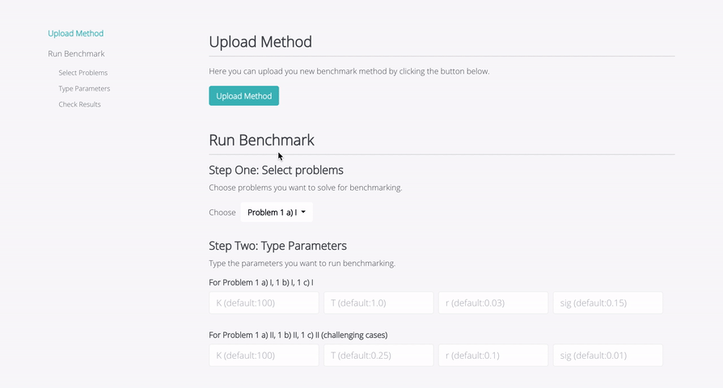
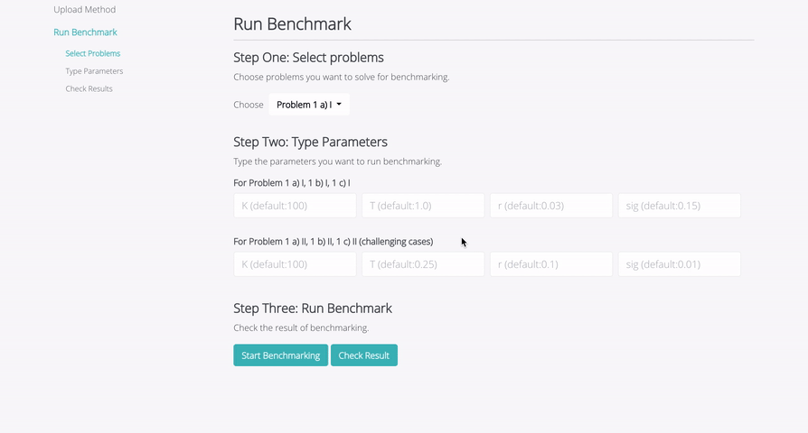
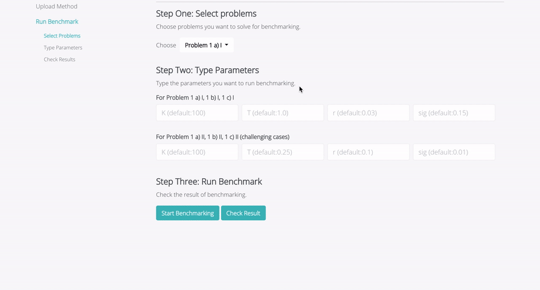
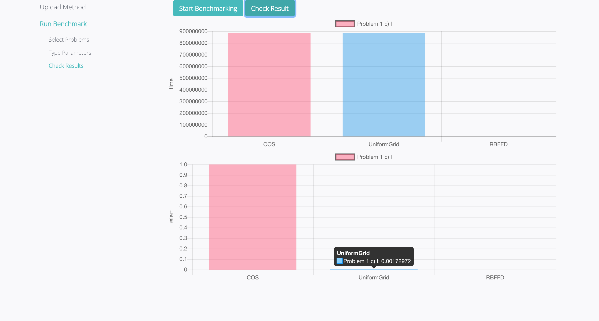
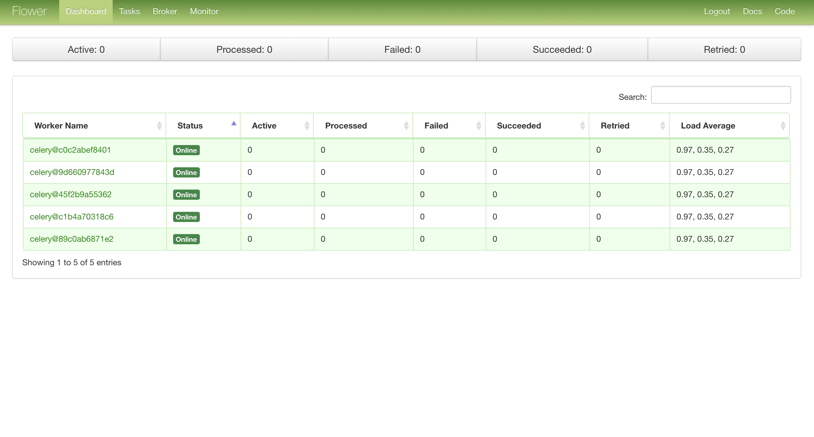

Benchop on Celery 
================================================

Introduction
--------------------------------------

This implementation is a cloud-based version of Benchop project - a benchmarking solution for methods of simulating option pricing. Since this project is a computational demanding task, the program runs on celery which can be scaled to multiple workers. All codes have been dockerized for easy deployment. 

1. [Benchop on Celery with Swarm](https://github.com/jlliao/benchop)
2. [Benchop Project by Uppsala University](http://www.it.uu.se/research/scientific_computing/project/compfin/benchop)


Environments in which to use Benchop on Celery
--------------------------------------

- This version is used for simulating cloud environment in a single machine using docker technology.
- To check out how it can be deployed on Openstack and scaled by Docker Swarm, please go to [Benchop on Celery with Swarm](https://github.com/jlliao/benchop).


What do you get with Benchop on Celery
--------------------------------------

With Benchop on Celery, you would be able to select which problem(s) you would like to solve, and type the parameter for which you would like to run the methods. If you do not type the parameter, the program will solve the problem(s) with default parameter.

<div style='border: 2px solid #f00;'>
  
</div>
</br>

And then you can click "Start Benchmarking", for which a task id will be returned. 

<div style='border: 2px solid #f00;'>
  
</div>
</br>

You can click "Check Result" to see if the result is available. If the result is computed, then relevant graphs will show up. Here is an example of executing problem 1 a) I.

<div style='border: 2px solid #f00;'>
  
</div>
</br>

Here is another example of executing problem 1 c) I. Some result does not show up because the outcome of running the benchop program might be NaN.

<div style='border: 2px solid #f00;'>
  
</div>
</br>

And of course, you can use flower to monitor all the states of workers.

<div style='border: 2px solid #f00;'>
  
</div>
</br>

Installation
----------------------------

Clone a copy of the Benchop on Celery git repo by running:

```bash
git clone https://github.com/jlliao/benchop-celery
```

Enter the benchop directory and run the docker compose build script:
```bash
cd benchop-celery && docker-compose build
```
This will create four decoupled services: `web`, `worker`, `monitor` and `redis`. Each image will start the service from Ubuntu 16.04 environment. 

Now to run all services in the detached mode, simply type the command:
```bash
docker-compose up -d # run in detached mode
```
After all the services are up and running, you can go to Now load `http://your-dockermachine-ip:5000` in browser. It should welcome you with a user interface.

To monitor that the worker is working fine, go to `http://your-dockermachine-ip:5555`. It runs a flower server. It should show one worker ready to serve.

To scale the workers, now run
```bash
docker-compose scale worker=5
```
This will create 4 more containers each running a worker. `http://your-dockermachine-ip:5555` should now show 5 workers waiting for some jobs!

If you want to further leverage on cloud environment and deploy more workers and containers on various instances, please check out [Benchop on Celery with Swarm](https://contribute.jquery.org/).

### Files

This section contains explanations for each file:

- **cloud-config.txt**: Cloud Config text file which is used for contextualization of the cloud environment. It sets up docker service in the OpenStack instance.
- **docker-compose.yml**: Defining and running multi-container Docker applications
- **Dockerfile.server**: Instructions for building web docker image
- **Dockerfile.worker**: Instructions for building worker and monitor docker image
- **requirements.txt**: Containing a list of items to be installed using `pip install`
- **static**: Including javascript and css files that serve the web interface and interactions, in which `index.js` describes most of events
- **templates**:  Including html template files
- **worker.py**: celery worker configuration
- **app.py**: The flask server file that creates API for REST actions
- **newtable.m**: Re-edit `table.m` file that allows user to choose specific problem(s), parameters and return results back to python scripts
- The rest of the files are original Benchop project files